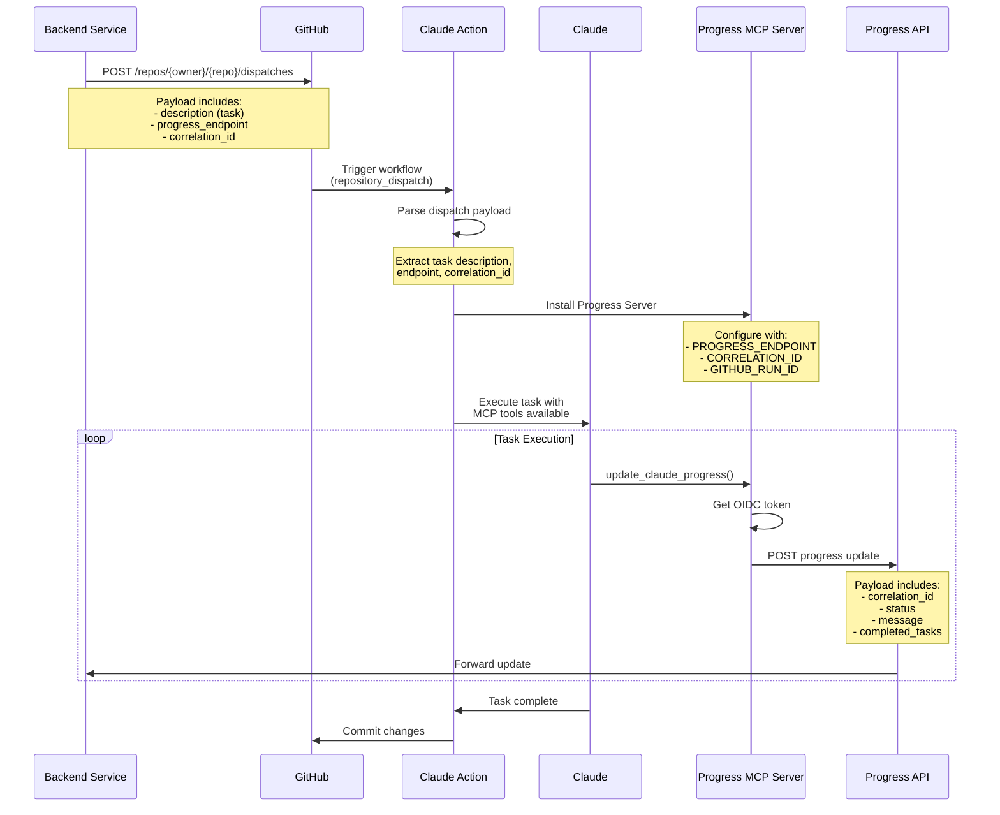

## Summary

Adds support for `repository_dispatch` events, enabling backend services to programmatically trigger Claude to perform tasks and receive progress updates via API.

## Architecture



## Key Features

### 1. Repository Dispatch Support

- New event handler for `repository_dispatch` events
- Extracts task description, progress endpoint, and correlation ID from `client_payload`
- Bypasses GitHub UI interaction for fully programmatic operation

### 2. Progress Reporting MCP Server

- New MCP server (`progress-server.ts`) for sending progress updates
- OIDC authentication for secure API communication
- Includes correlation ID in all updates for request tracking

### 3. Simplified Dispatch Prompts

- Focused instructions for dispatch events (no PR/issue context)
- Clear directives: answer questions or implement changes
- Automatic progress updates at start and completion

## Implementation Details

### Triggering a Dispatch

```bash
curl -X POST \
  https://api.github.com/repos/{owner}/{repo}/dispatches \
  -H "Authorization: token $GITHUB_TOKEN" \
  -H "Accept: application/vnd.github.v3+json" \
  -d '{
    "event_type": "claude-task",
    "client_payload": {
      "description": "Implement a new feature that...",
      "progress_endpoint": "https://api.example.com/progress",
      "correlation_id": "req-123-abc"
    }
  }'
```

### Progress Update Payload

```json
{
  "repository": "owner/repo",
  "run_id": "123456789",
  "correlation_id": "req-123-abc",
  "status": "in_progress",
  "message": "Implementing feature...",
  "completed_tasks": ["Setup environment", "Created base structure"],
  "current_task": "Writing tests",
  "timestamp": "2024-01-17T12:00:00Z"
}
```

## Security

- **OIDC Authentication**: All progress updates use GitHub OIDC tokens
- **Correlation IDs**: Included in request body (not URL) for security
- **Endpoint Validation**: Progress endpoint must be explicitly provided
- **No Credential Storage**: Tokens are generated per-request

## Testing

To test the repository_dispatch flow:

1. Configure workflow with `repository_dispatch` trigger
2. Send dispatch event with required payload
3. Monitor GitHub Actions logs for execution
4. Verify progress updates at configured endpoint

## Changes

- Added `repository_dispatch` event handling in `context.ts`
- Created new `progress-server.ts` MCP server
- Updated `isDispatch` flag across all event types
- Modified prompt generation for dispatch events
- Made `githubData` optional for dispatch workflows
- Added correlation ID support throughout the pipeline
